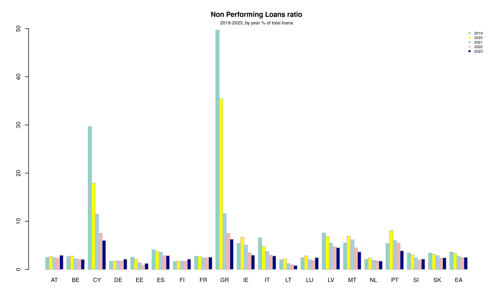
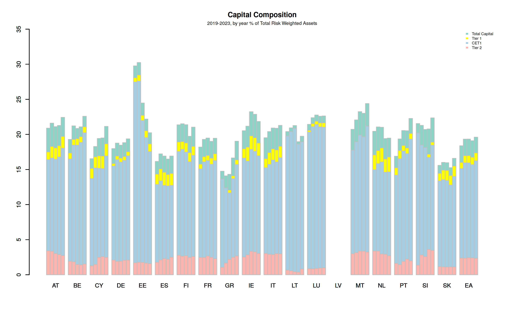
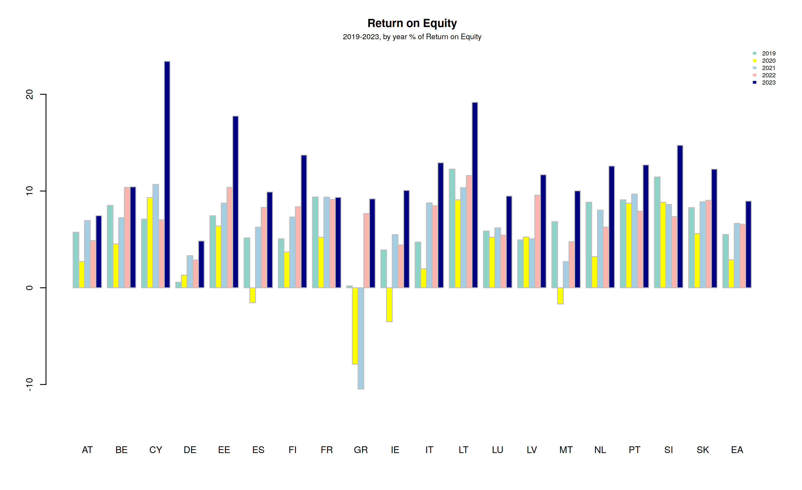
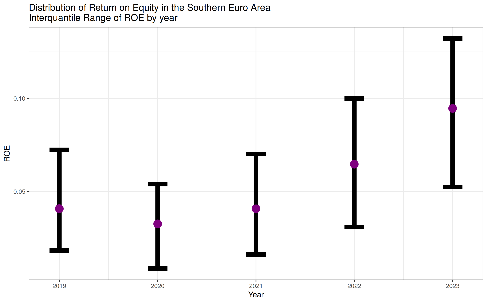

# Euro Area Banking Metrics, 2019–2023

Asset quality, capitalisation and profitability of euro area banks, 2019–2023: non-performing
loans, capital ratios, return on equity, return on assets and net interest margin, by country
and macro-region. Bank-level BankFocus data.

**Bottom line.** Asset quality improved the most. On a fixed sample of banks, the southern NPL
ratio fell from 7.3% to 3.1% and the gap with the North narrowed from 4.9 to 1.2 percentage
points, with no reversal during Covid. Profitability fell in 2020 and then recovered everywhere,
reaching its highest level in 2023. The recovery was uneven across regions: in 2023 the median
eastern bank earned a return on equity about five times that of the median central bank.

## Project overview

- **Question.** How did asset quality, capital and profitability of euro area banks evolve
  through the Covid shock and the subsequent monetary tightening, and how much do they differ
  across countries and macro-regions?
- **Scope.** 3,443 banks across 19 euro area countries, five years of annual accounts.
  Croatia is excluded because it adopted the euro only in 2023.
- **Consolidation.** BankFocus lists a bank once per consolidation level (codes C1, C2, U1, U2,
  C\*, U\*). Only one statement per bank and year is kept, chosen by the priority
  C1 > U1 > U2 > C2 > C\* > U\* among the statements that report the variables needed, so that no
  bank is counted twice.
- **Aggregation.** Country, regional and euro area ratios are **system aggregates**: the sum of
  the numerator over the sum of the denominator, so large banks weigh according to their size.
  The net interest margin, already a ratio for each bank, is summarised with the **median**. For
  the macro-regions, the distribution of bank-level ROE is shown as median and interquartile
  range.
- **Macro-regions.** North (EE, FI, IE, NL), Center (AT, BE, DE, FR, LU), South (CY, ES, GR,
  IT, MT, PT), East (LT, LV, SI, SK), following the grouping of the original study. Estonia sits
  in the North rather than with the other Baltic states: this is a convention of that grouping,
  not a geographic claim.

## Data

Source: BankFocus (Moody's / Bureau van Dijk), annual accounts 2019–2023, amounts in EUR
thousands. BankFocus is a licensed database, so the data are not included in this repository,
and nothing in it is shown at the level of individual banks: the notebook, the tables and the
charts contain only aggregates by country, macro-region and euro area.

| Sheet | Content |
|---|---|
| `Results`, `Results (20)` … `Results (23)` | one sheet per year: total assets, net loans to customers, impaired / non-performing loans, total capital, Tier 1, CET1, Tier 2, RWAs |
| `Results (2)` | net income, equity and net interest income for each year, then total assets and total capital |
| `Results (3)` | net interest margin for each year |

Five adjustments make the figures comparable and safe to publish:

1. **Central banks removed.** National central banks (Deutsche Bundesbank, Banque de France,
   Banca d'Italia, De Nederlandsche Bank and ten others) appear among the banks. They are not
   part of the banking sector and would dominate some country totals.
2. **Statements without financials removed** (consolidation codes NF and LF).
3. **Balanced sample for balance-sheet indicators.** Reporting of NPL is not constant over time:
   German banks reporting NPL fall from 1,142 in 2019 to 77 in 2021. Loans, NPL and capital
   ratios are therefore computed on the banks that report them in every year: **1,144 banks for
   NPL and 1,169 for capital**. The profitability sheets do not have this problem: about 3,300
   banks report net income and equity every year.
4. **No joins by row position.** Each sheet lists the banks in a different order, so sheets are
   processed separately and never matched row by row.
5. **Statistical confidentiality.** As in official statistics, no value is published if it rests
   on fewer than 3 banks, because it would reveal the figures of an individual bank. This
   applies to the capital ratios of Latvia, where only one bank reports capital in every year.

## Results

**Euro area**, system aggregates, per cent:

| | 2019 | 2020 | 2021 | 2022 | 2023 |
|---|---|---|---|---|---|
| NPL ratio | 3.60 | 3.33 | 2.75 | 2.46 | 2.52 |
| Total capital ratio | 18.39 | 19.33 | 19.34 | 19.10 | 19.61 |
| CET1 ratio | 15.11 | 15.95 | 15.93 | 15.68 | 16.23 |
| ROE | 5.50 | 2.89 | 6.66 | 6.57 | 8.96 |
| ROA | 0.41 | 0.21 | 0.46 | 0.46 | 0.67 |
| NIM, median bank | 1.55 | 1.45 | 1.35 | 1.44 | 2.01 |

- Profitability halved in 2020 and then recovered. In 2023 ROE reached 9%, as the ECB rate
  hikes widened net interest margins: the median NIM rose from 1.44% to 2.01% in one year.
- Capital buffers strengthened, with CET1 rising from 15.1% to 16.2% of risk-weighted assets.

**Asset quality by macro-region**

NPL ratio, system aggregate on the balanced sample of 1,144 banks, per cent:

| Region | 2019 | 2020 | 2021 | 2022 | 2023 |
|---|---|---|---|---|---|
| North | 2.41 | 2.70 | 2.18 | 1.94 | 1.95 |
| Center | 2.48 | 2.45 | 2.24 | 2.19 | 2.44 |
| East | 3.63 | 3.34 | 2.82 | 2.29 | 2.33 |
| South | 7.32 | 5.91 | 4.36 | 3.50 | 3.13 |

This is the largest change in the data. The South more than halved its NPL ratio and the East
cut it by about a third, while the North and Center, starting from lower levels, changed much
less: the North went from 2.4% to 2.0%, the Center stayed at about 2.4%. The
South–North gap narrowed from 4.9 to 1.2 percentage points. The improvement did not reverse in
2020, consistent with the public guarantee schemes and moratoria that kept defaults from reaching
bank accounts. At country level, the Greek NPL ratio fell from 49.7% to 6.3% and the Cypriot one
from 29.7% to 6.0%.

The balanced sample has its own composition: Italy and France contribute 49% of its banks,
Germany only 56. Because the ratios are weighted by volume, what matters most is loan size:
France accounts for 38% of the sample's loans in 2023, Germany 13%.

**Profitability by macro-region**

Median bank ROE, per cent:

| Region | Banks | 2019 | 2020 | 2021 | 2022 | 2023 |
|---|---|---|---|---|---|---|
| East | 46–47 | 8.17 | 5.27 | 7.59 | 8.27 | 13.51 |
| South | 680–696 | 4.08 | 3.26 | 4.07 | 6.46 | 9.46 |
| North | 214–233 | 3.69 | 3.01 | 3.59 | 4.19 | 9.39 |
| Center | 2,244–2,371 | 2.37 | 1.90 | 2.29 | 1.73 | 2.55 |

- The East is the most profitable region in every year. It is also by far the smallest, with
  about 47 banks, so its figures rest on a narrow base.
- The South and North caught up in 2022–2023. The Center stays low throughout: it holds about
  70% of the banks, most of them German savings and cooperative banks with thin returns.

**Country detail.** ROE, system aggregate, per cent (selection):

| Country | 2019 | 2020 | 2021 | 2022 | 2023 |
|---|---|---|---|---|---|
| CY | 7.09 | 9.33 | 10.69 | 7.03 | 23.41 |
| LT | 12.27 | 9.09 | 10.35 | 11.60 | 19.17 |
| IT | 4.73 | 1.97 | 8.77 | 8.48 | 12.92 |
| GR | 0.20 | −7.91 | −10.48 | 7.68 | 9.19 |
| FR | 9.38 | 5.23 | 9.37 | 9.12 | 9.34 |
| ES | 5.16 | −1.55 | 6.25 | 8.30 | 9.90 |
| DE | 0.57 | 1.31 | 3.32 | 2.87 | 4.84 |

- Greece is the clearest turnaround: losses in 2020 and 2021, then a return close to the euro
  area average from 2022.
- Germany is the least profitable large system throughout. France is almost flat, and is the only
  large system where 2023 is below 2019.

## Code

The analysis is written in R:

| File | Content |
|---|---|
| `cs1_banking_metrics.ipynb` | notebook with the full analysis step by step. It is saved already executed, so every table and all 14 charts can be read directly on GitHub without running anything |
| `cs1_banking_metrics.R` | the same analysis as a single script |

R packages: readxl, dplyr, tidyr, purrr, ggplot2, scales.

## Limitations

- **This is descriptive.** Nothing is estimated or tested. The link between policy rates and
  margins is read off the time pattern, not identified.
- **The NPL ratio uses net loans as the denominator**, while the supervisory convention uses
  gross loans. Levels are therefore slightly higher than published ECB statistics; comparisons
  across regions and over time are unaffected.
- **The balanced sample trades coverage for comparability.** It keeps about half of the banks
  that report NPL in 2019, and the excluded banks may differ from those that stay.
- **Bank identity is name + country.** BankFocus has no stable identifier in this export, so a
  bank that changed name between years is treated as two banks.

## Conclusion

The clearest result is the convergence in asset quality. On a fixed sample of banks observed in
every year, the southern NPL ratio more than halved between 2019 and 2023, without interruption
through Covid, closing most of the gap with the rest of the euro area. Profitability tells a
more uneven story: every region recovered after 2020, but the higher rates of 2022–2023 lifted
returns in the East, South and North much more than in the Center, where most of the
institutions are.

